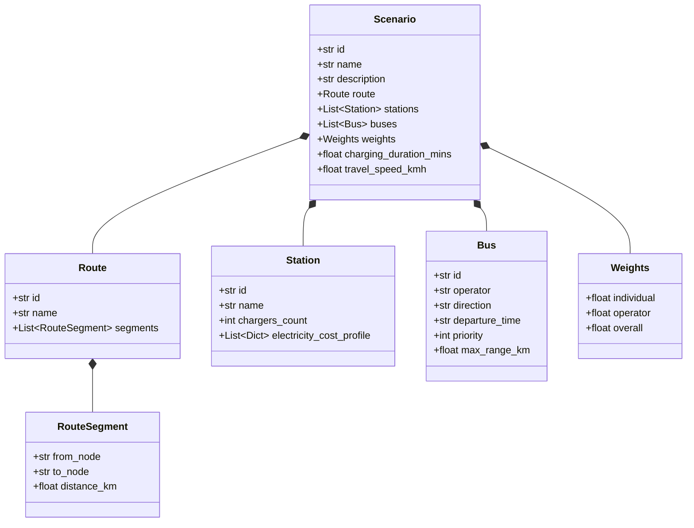

# 📐 Scheduling Architecture & Technical Design

This document details the architecture, modeling formulation, design patterns, and scaling strategies for the **Electric Bus Charging Scheduler**.

---

## 🧠 Scheduling Framework Selection

### Why Google OR-Tools CP-SAT?
The bus charging scheduling problem belongs to the class of **Job-Shop Scheduling Problems** (with resource constraints and route precedence), which are NP-hard. We selected **Google OR-Tools CP-SAT (Constraint Programming - Satisfiability)** over other paradigms (MILP, Heuristics, Reinforcement Learning) for the following reasons:

1. **Native Scheduling Abstractions**:
   CP-SAT provides first-class primitives for scheduling:
   - **Interval Variables**: Represents activities with a `start`, `duration`, and `end`.
   - **Optional Interval Variables**: Represents activities that may or may not occur (e.g. charging at a station is optional, represented by `model.NewOptionalIntervalVar`).
   - **Disjunctive Constraints (`NoOverlap`)**: Restricts resources (chargers) from being occupied by multiple activities concurrently.
   - **Cumulative Constraints**: Restricts multi-capacity resources (e.g. stations with multiple chargers) dynamically.
   
   In Mixed-Integer Linear Programming (MILP), modeling resource non-overlap requires a "Big-M" formulation for every pair of buses at every station:
   $$s_i \ge e_j - M(1 - y_{ij})$$
   This introduces $O(N^2)$ binary variables and constraints per station, which degrades solver performance. CP-SAT handles this internally via specialized scheduling propagators (edge-finding, energy-based reasoning) which are orders of magnitude faster.

2. **Numerical Stability**:
   Traditional MILP solvers use floating-point arithmetic, which is susceptible to numerical drift and precision issues. CP-SAT operates entirely on integer domains, ensuring exact constraint validation and determinism.

3. **Pluggable Rules Engine Integration**:
   CP-SAT models are constructed imperatively by adding constraints to a model object. This fits the **Rule Engine Pattern** perfectly. Each rule is a modular class that applies its own constraints and objective terms to the model, rather than relying on a rigid matrix generator.

---

## 🎨 Data Model Design & Future-Proofing

Our data model, defined in `scheduler/models.py` using **Pydantic v2**, is designed to decouple operational parameters from the solver core.



### Future Scalability: Data-Driven Evolution
Here is how our design handles future requirements **without code changes**:

| Future Requirement | Architectural Handling (No Code Changes) |
| :--- | :--- |
| **Multiple Chargers per Station** | Handled by `chargers_count` in `Station`. The `NoOverlapRule` automatically swaps the disjunctive `AddNoOverlap` constraint for a `AddCumulative` constraint with capacity equal to `chargers_count`. |
| **New Stations / Segments** | Handled by modifying the `route.segments` list and `stations` list in the JSON. The solver parses the segment distances and builds the battery and travel equations dynamically. |
| **New Operators** | Handled by specifying the operator name in `Bus.operator`. The `OperatorFairnessRule` automatically groups buses and builds average wait time metrics dynamically. |
| **Priority Buses** | Handled by the `priority` field in the `Bus` JSON. Highly prioritized buses can be weighted heavier in soft objective functions or handled via priority-based rules. |
| **Time-of-Day Electricity Costs** | Handled by loading the `electricity_cost_profile` list of dicts in the `Station` model. The solver can map the `charge_start` integer variable to the corresponding cost bracket using CP-SAT element constraints. |
| **Driver Shift Constraints** | Represented in data as max continuous travel time per bus before a mandatory long wait. These parameters can be embedded in scenario configs and enforced by a pluggable `DriverShiftRule`. |
| **Dynamic/Varying Charging Durations** | Covered by `charging_duration_mins` at the Scenario or Station level, which determines the optional interval size variable dynamically. |

---

## ⚡ Pluggable Rule Engine Pattern

Every constraint (hard or soft) is defined as a class inheriting from `Rule` in `scheduler/rules.py`. 

### Code Example: Changing a Weight
To adjust weights programmatically, update the JSON config or pass overrides to `ScheduleOptimizer.optimize`:

```python
from scheduler.optimizer import ScheduleOptimizer
from utils.loader import load_scenario_by_id

# 1. Load Scenario
scenario = load_scenario_by_id("data", 4)

# 2. Define custom weights to prioritize operator fairness
custom_weights = {
    "individual": 1.0,
    "operator": 5.0,  # Prioritize balancing operators
    "overall": 0.5    # Deprioritize total network delay
}

# 3. Optimize
optimizer = ScheduleOptimizer()
result = optimizer.optimize(scenario, custom_weights=custom_weights)
print(f"Solved! Total wait time: {result.total_wait_time} mins.")
```

### Code Example: Adding a New Rule
Adding a new rule requires creating a rule class and registering it. 

Here is how you would add a **"Charger Blackout Period"** rule (e.g. maintenance from 21:00 to 21:30 at Station B):

```python
# 1. Define the pluggable rule in scheduler/rules.py
from scheduler.rules import Rule
from utils.helpers import parse_time_to_mins

class ChargerBlackoutRule(Rule):
    @property
    def name(self) -> str:
        return "ChargerBlackoutRule"

    @property
    def description(self) -> str:
        return "Prevents charging at Station B between 21:00 and 21:30 due to maintenance."

    def apply(self, model, scenario, vars_dict) -> None:
        charge_start = vars_dict["charge_start"]
        charge_end = vars_dict["charge_end"]
        charge_active = vars_dict["charge_active"]
        
        blackout_start = parse_time_to_mins("21:00")
        blackout_end = parse_time_to_mins("21:30")
        
        for bus in scenario.buses:
            # If the bus charges at B, its charging interval must not overlap [21:00, 21:30]
            # In CP-SAT, we write: (charge_end <= blackout_start) OR (charge_start >= blackout_end) OR (charge_active is false)
            is_before = model.NewBoolVar(f"{bus.id}_charge_before_blackout")
            is_after = model.NewBoolVar(f"{bus.id}_charge_after_blackout")
            
            model.Add(charge_end[bus.id, "B"] <= blackout_start).OnlyEnforceIf(is_before)
            model.Add(charge_start[bus.id, "B"] >= blackout_end).OnlyEnforceIf(is_after)
            
            # If charge is active, one of the before/after conditions must hold
            model.Add(is_before + is_after >= 1).OnlyEnforceIf(charge_active[bus.id, "B"])

# 2. Register the rule in scheduler/engine.py
# inside SchedulingEngine.__init__:
self.rules = [
    RouteOrderRule(),
    BatteryRangeRule(),
    NoOverlapRule(),
    ChargerBlackoutRule(), # Newly registered pluggable rule!
    MinIndividualWaitRule(),
    OperatorFairnessRule(),
    MinNetworkDelayRule()
]
```

---

## 📝 Core Operational Assumptions

1. **Station Chargers**:
   - Chargers are located at intermediate stations A, B, C, D only. 
   - Origin terminals (Bengaluru and Kochi) have overnight slow chargers that guarantee buses depart with a 100% full charge (240 km range).

2. **Charging Characteristics**:
   - Charging always charges the battery to 100% (240 km).
   - Charging duration is fixed at exactly 25 minutes.
   - Partial charging is not permitted.

3. **Speed and Travel Time**:
   - Buses travel at a constant speed of 60 km/h.
   - Segment travel times are constant: a 100 km segment takes exactly 100 minutes. There are no traffic variations or breakdowns.

4. **Time Horizon**:
   - The scheduling horizon is modeled as 48 hours (2880 minutes) starting from midnight of the first day to accommodate late departures arriving the next morning without boundary clipping.
